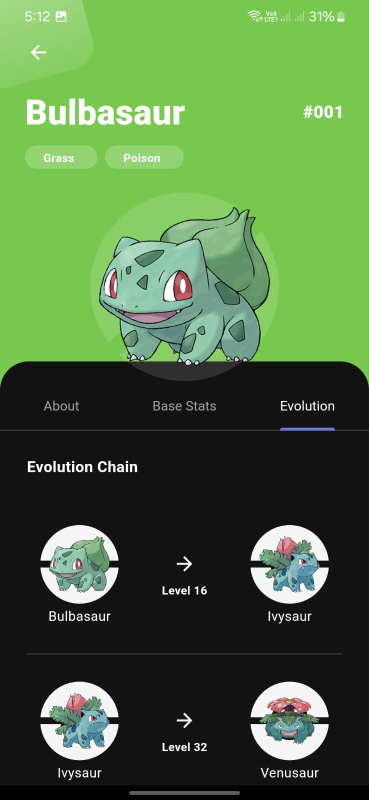

# Pokédex App

Pokédex App is an application developed using Flutter that provides a Pokemon Database App designed using Clean Architecture principles. It contains features such as home screen with infinite scrolling showing the Pokédex and Pokemon Detail.

## Features

1. **Home Page**
   - Displays list of Pokemon. (Infinite Scroll)

2. **Pokemon Details**
   - Provides detailed information about selected Pokemon.

## Tech Stacks

1. **Clean Architecture**
Create a separation of concern between layers into presentation, domain, and data for a modular and scalable codebase.
   - **Presentation Layer**: Contains UI components and presentation logic.
   - **Domain Layer**: Defines use cases and business logic independent of UI.
   - **Data Layer**: Manages data sources, repositories, and external services.

2. **Bloc**
   - A state management that helps to separate presentation layer from business logic.

3. **Isolate for JSON Parsing**
   - Efficiently parses JSON data using isolates for better performance.

## Open API
Pokedex App uses the PokeAPI ("https://pokeapi.co/")

## Pokédex App Preview

  
  
  

  
  

  
  
  

  
  

